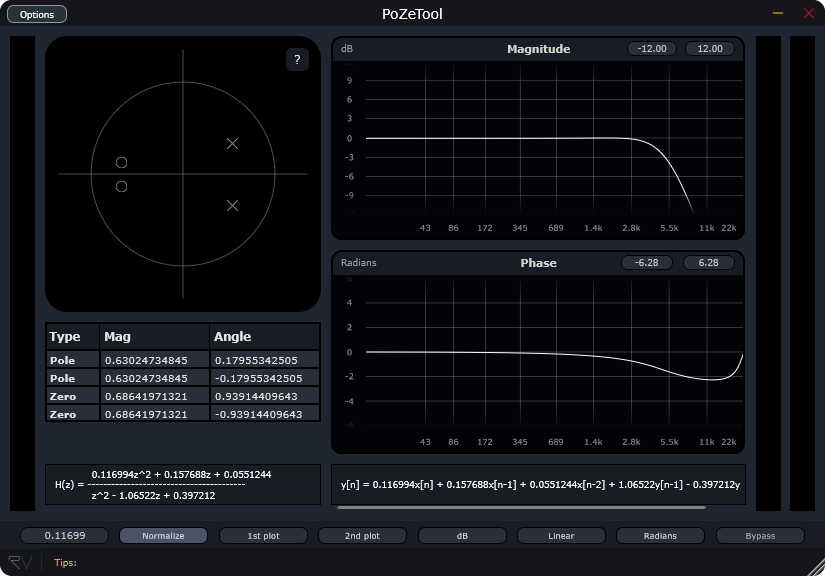

# PoZeTool

## Pole–Zero Tool for Digital Filter Design

PoZeTool is an interactive filter design and visualization tool.
It allows you to place poles and zeros in the Z-plane and instantly observe how they affect a filter’s behavior.
It can be used as an audio plugin or in standalone mode.

The tool is intended primarily for educational purposes, helping DSP learners build intuition about the relationship between pole–zero locations and filter responses / coefficients.

### Features

PoZeTool provides real-time visualization of:

- Magnitude response
- Phase response
- Group delay
- Phase delay
- The transfer function
- The difference equation

It also implements a filter so you can hear how the filter sounds. 

### Supported platforms
- Windows
- MacOS
- Linux

### Supported formats
- VST3
- AU
- Standalone